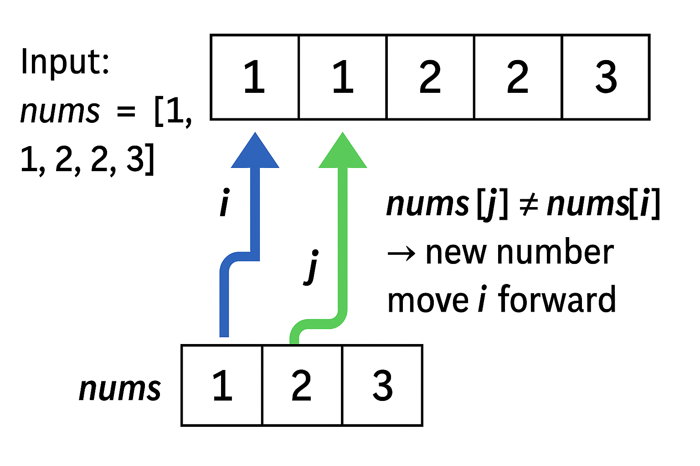

# DSA Solutions 🚀

This repository contains solutions to popular **Data Structures and Algorithms** problems using Java.

---

## 📌 Problem: Remove Duplicates from Sorted Array

This Java solution removes duplicates from a sorted array in-place and returns the number of unique elements.

🔗 **Problem Link**:  
[Remove Duplicates from Sorted Array – LeetCode](https://leetcode.com/problems/remove-duplicates-from-sorted-array/description/)

---

### 📷 Visual Explanation


[🔗 Click to view image on GitHub](https://github.com/shrutilad20/DSA/blob/main/images/diagram.png)

---

## ✅ Topics Covered
- Arrays
- Two Pointer Technique
- In-place Operations
- Time Complexity Optimization

---

## 💻 Run the Code
```bash
javac RemoveDuplicates.java
java RemoveDuplicates
